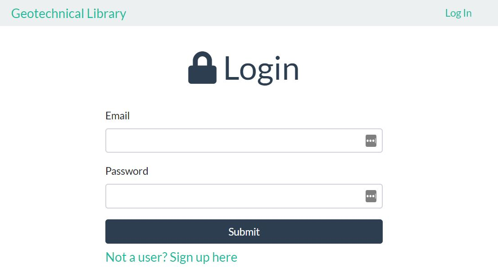

# Geotechnical Library

A library app that utilizes firebase to store both the registered users and book catalog



## Frameworks

- React-Redux-Firebase
- React Redux
- Bootstrap
- React Router

## Installation

Use the package manager [npm](https://www.npmjs.com/) to install related dependencies.

```bash
npm install
```

## Usage

Start the app by running the start script

```bash
npm run start
```

This will open a local instance on [http://localhost:3000/]

## Contributing

Pull requests are welcome. For major changes, please open an issue first to discuss what you would like to change.

Please make sure to update tests as appropriate.

## License

[MIT](https://choosealicense.com/licenses/mit/)
